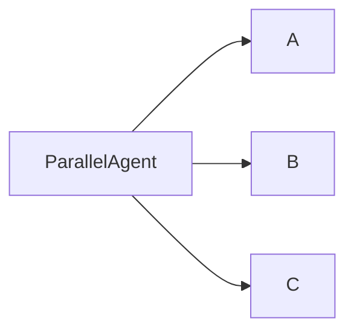

# 워크플로우 에이전트 클래스란
이 에이전트 클래스들은 LLM 없이 하위 에이전트 들을 특정 순서대로 호출만 해주는 클래스들임. (LLM에이전트 클래스처럼 model="{모델명}" 인자를 넘기면 pydantic 오류 발생함)
SequentialAgent는 sub_agents 인자에 하위 에이전트 클래스들을 리스트로 던져주면 리스트 안에 에이전트들을 앞에서부터 순차적으로 호출함.
처리 프로세스 설계에 따라 적절한 워크플로우 클래스들을 사용하면 됨.

## Sequential Agent
sub-agents 인자로 하위 에이전트 클래스들을 넘기면 각 에이전트를 순차적으로 호출

## Loop Agent
sub-agents 인자로 넘긴 에이전트들을 max_iterations 인자값 만큼 반복 호출함 Sequential하게 하위 에이전트들을 순서대로 한번 호출하는게 iterations 1번임. \
ex)
sub-agents=[a,b] 이고 max_iterations=2일때, \
호출 순서는 a,b,a,b 임

## Parallel Agent
sub-agents 인자로 넘긴 에이전트들을 병렬로 호출함. sub_agents에 넘긴 에이전트 갯수만큼 브랜치가 생기는 개념.

(플로우 예시) - sub_agents = [A,B,C] 인 경우

